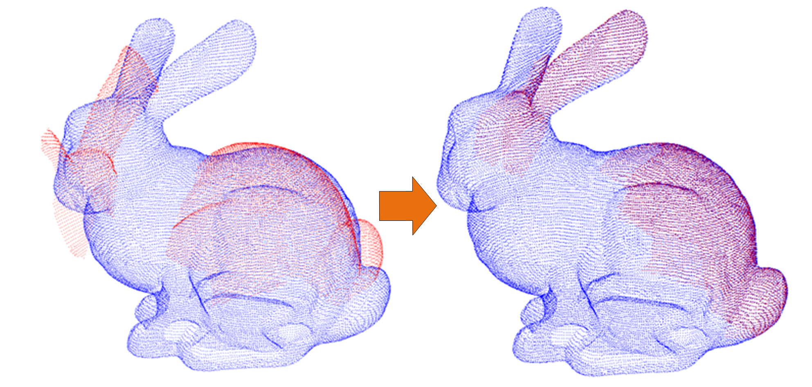

+++
title = "Point Clouds Registration"
date = 2025-06-02
categories = ["Point Cloud Registration"]
tags = ["Point Cloud Registration"]
+++
## 点云配准基础与应用
- 点云的概念：三维点云是空间中的一组数据点，主要包括刚性点云和非刚性点云，是表达物体或场景几何信息的重要数据形式，广泛应用于计算机视觉、机器人导航、自动驾驶、增强现实等领域。
- 点云配准：点云配准是对从同一场景的不同位置采集的两个或多个三维点云进行配准的过程，需要找到源点云和目标点云之间的对应关系，然后求解他们之间的变换矩阵{R,t}（旋转矩阵和平移矩阵）。主要有刚性点云配准和非刚性点云配准。  

点云配准示例图
   

- 点云配准的应用：    三维重建、自动驾驶

## 点云配准方法
- 传统点云配准方法：ICP（Iterat-ive Closest Point）方法就是一种经典的点云配准算法（Besl等， 1992），通过迭代的方法来进行三维点云配准，但是当点云结构较为复杂时，ICP方法处理并不理想。NDT（Normal Distributions Transform）是一种经典的点云配准方法（Magnusson等， 2007），在NDT中点云被看作是一个具有均值和协方差矩阵的高斯分布。但是计算复杂，开销大。另一种经典的算法是CPD（Coherent Point Drift）。CPD算法将点云配准问题视为概率密度估计问题，通过计算点对之间的相似性估计变换矩阵，但是在大规模点云配准上效果差（Myronenko等， 2010）。这些传统方法经过多年的研究和实践，理论基础较为成熟，具有较高的稳定性和可靠性，并且在不同场景下的适用性较强，特别是在工业、医疗等领域已有较多成功应用。
- 传统点云配准方法缺点：需要多次迭代配准，每次迭代可能涉及大量点的匹配和距离计算，计算复杂度较高，而且对噪声和遮挡较为敏感，特别是在存在较大误差或部分丢失数据的情况下，可能难以得到准确的结果
- 基于深度学习的点云配准方法：基于深度学习的方法主要分为基于特征提取和端到端学习，前者通过深度学习模型从点云中自动提取特征，通过特征对应计算变换矩阵。端到端学习的配准省去匹配的过程，模型直接从输入的点云对中学习变换矩阵。基于深度学习的点云配准方法在精度和鲁棒性上有很大优势，但是往往需要大量数据支持且时间消耗更大。
## 基于深度学习的点云配准
- 主要流程：
	- 1）输入源点云和目标点云；
	- 2）寻找源点云与目标点云之间的对应关系； 
	- 3）寻找源点云与目标点云之间的最佳变换； 
	- 4）得到最终的变换矩阵。
	其中对应关系的求解与变换矩阵的求解在点云配准中尤为关键
![[Pasted image 20250604161525.png]]
==RPMNet流程==
--
## 挑战与未来发展趋势
